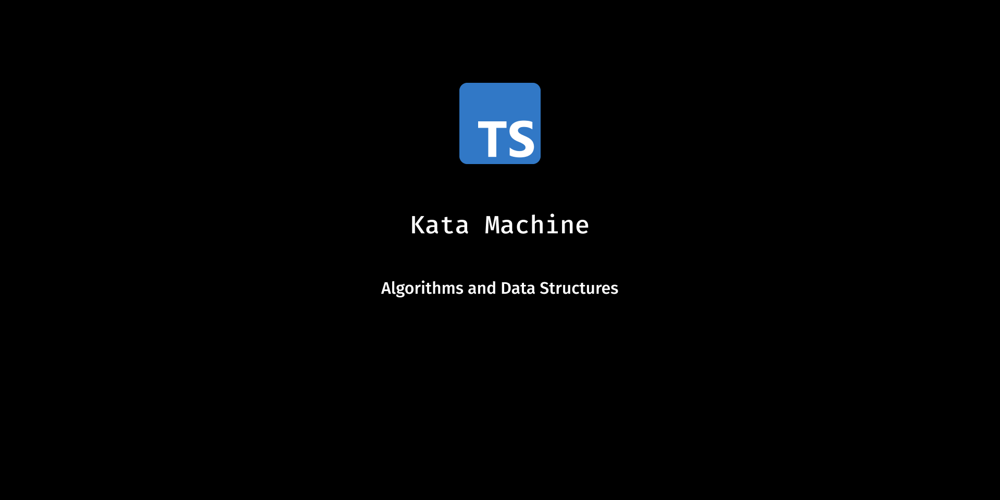

<h2 align="center">
  Kata Machine
</h2>
<p align="center">
  Algorithms and Data Structures
</p>

## Table of Contents

- [Description](#description)
- [Installation](#installation)
- [Usage](#usage)

## Description

This repository contains a collection of algorithms and data structures implemented in TypeScript. This project follows the **The Last Algorithms Course You'll Need** course from [Frontend Masters](https://frontendmasters.com/courses/algorithms) by [ThePrimeagen](https://github.com/theprimeagen). 

The repository itself is a fork from [Main Repository](https://github.com/ThePrimeagen/kata-machine/).

## Installation

Clone this repository and install the dependencies.

```bash
$ git clone https://github.com/matheuslanduci/kata-machine.git

$ cd kata-machine

$ yarn install
```

## Usage

You can run the tests so you can check if the algorithms are working properly.

```bash
$ yarn test
```